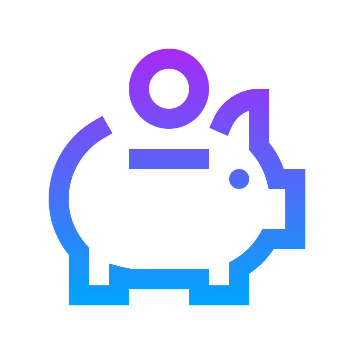
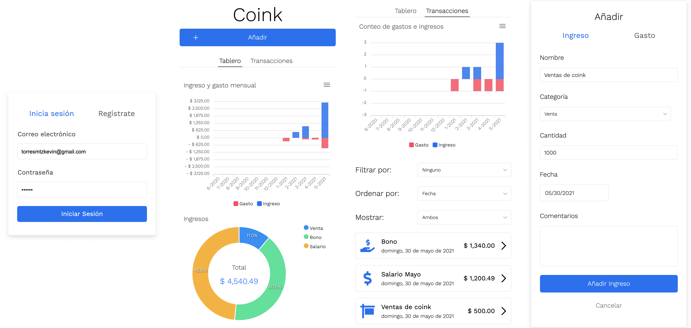

<p align="center" margin="128">
  <br/>
  
</p>

# coink


## Organiza tus finanzas

- Administrar tu dinero puede ser tedioso, coink te ayuda a juntar todos tus gastos e ingresos en un solo lugar
- Visualiza tus hábitos de gasto, tus hábitos de ahorro y tus ingresos fácilmente - sin complicadas hojas de cálculo
- Nuestras herramientas están diseñadas para ayudarle a ver su dinero con claridad y tomar decisiones financieras
- Regístrate en coink con sólo tu correo y disfruta de nuestro sitio web desde tu navegador o tu teléfono

<br/>



Proyecto final para nuestra clase de desarrollo web. [Ve nuestra presentación aquí](https://docs.google.com/presentation/d/1wIswKWDAteS3dQmHPtA0IAZ-UUVzKOucArsaG7dCCR4)

## Dependencias

Para ejecutar el servidor de **coink** es necesario instalar y correr la base de datos MongoDB localmente.

## Instalación y uso

1.- Descargar el código fuente

```
$ git clone https://github.com/KevinTMtz/coink.git
$ cd coink
```

2.- Instalar las dependencias de Node.js

```
$ yarn install
```

3.- Para ejecutar el servidor web es posible:

- Generar y ejecutar una versión optimizada de producción

```
$ yarn build
$ yarn start
```

- Ejecutar la versión de desarrollador

```
$ yarn dev
```

## Tecnologías

- Frontend
  
  

- Backend
  
  

- Database
  

## Creadores

<table>
  <tr>
    <td align="center"><a href="https://github.com/KevinTMtz"><br /><sub><b>Kevin Torres Martínez</b></sub></a><br />A01656257<br/></td>
    <td align="center"><a href="https://github.com/MarioJim"><br /><sub><b>Emilio Jiménez Vizcaíno</b></sub></a><br />A01173359</td>
    <td align="center"><a href="https://github.com/SebasRod23"><br /><sub><b>Sebastián Rodríguez Galarza</b></sub></a><br />A01656159</td>
  </tr>
</table>

## Licencia

Código publicado bajo [MIT License](https://github.com/kevintmtz/coink/blob/main/LICENSE).
